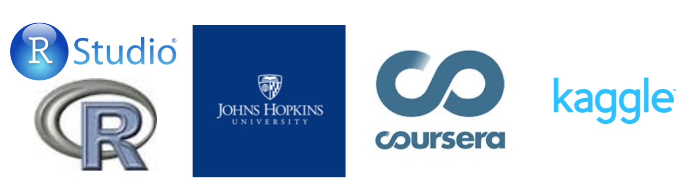

 The Titanic Survival Explorer is created as the initial analysis of  the Titanic data provided by [Kaggle competition](https://www.kaggle.com/c/titanic). The user input data for this application is the preprocessed train dataset with the constructed features (Title, FamilySize and CabinPr). The Random Forest algorithm uses the input features to calculate the classification accuracy of the passenger survival and to build the relative importance of selected variables.

 The application is a project for the [Developing Data Products Course](https://www.coursera.org/learn/data-products). This course is offered as a part of the [Coursera Data Science  Specialization](https://www.coursera.org/specializations/jhu-data-science) 
by [Johns Hopkins University](https://www.jhu.edu). 

The preprocessing and predictive algorithm are implemented in [R](https://cran.r-project.org) language.
The web interactive application is made using [Shiny](http://shiny.rstudio.com). You can find the code on my [GitHub]() and the supporting presentation on [RPubs](http://rpubs.com/anastasiia/142484).

**Contacts**

e-mail: a.chetverkina@yandex.ru

