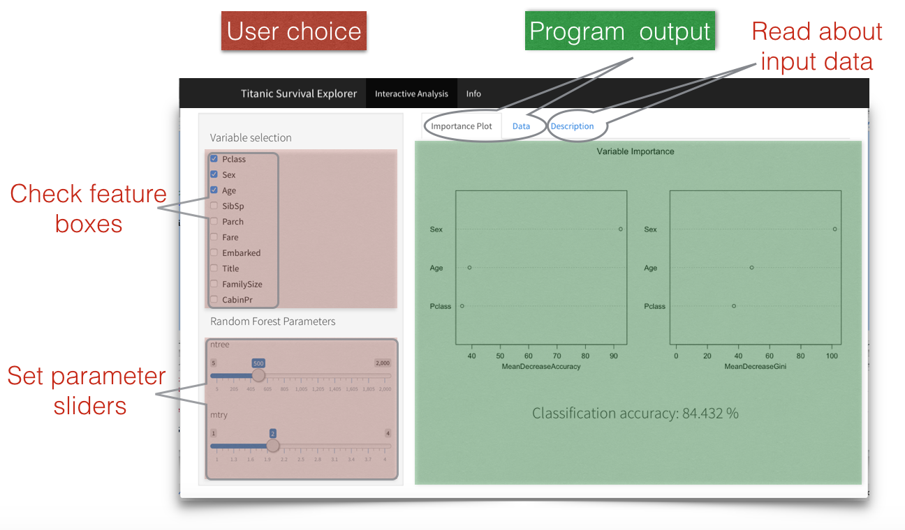

- Read about the proposed features and the algorithm parameters in the Description tabpanel
- Choose the variables and parameters that serve as the input data for the Random Forest classification
- the Data tabpanel shows the survival status and selected features
- Play with your choice to achieve better accuracy

